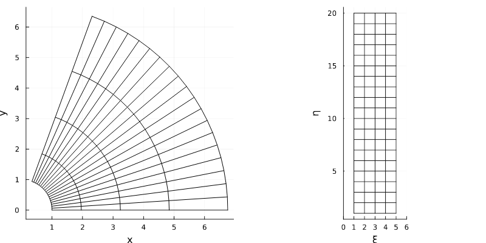

# CurvilinearGrids

[](https://github.com/smillerc/CurvilinearGrids.jl/actions/workflows/CI.yml?query=branch%3Amaster) [](https://opensource.org/licenses/MIT)

[](https://doi.org/10.5281/zenodo.14510380)

[](https://doi.org/10.21105/joss.07508)

`CurvilinearGrids.jl` is a Julia package that provides utilities for working with non-uniform curvilinear grids. The core function takes a grid and transforms it from $(x,y,z) \rightarrow (\xi,\eta,\zeta)$, where the transformed grid contains elements of unit length in each dimension. A common example of this is to use a body-fit mesh, e.g. a mesh around a wing, and transform it so that it becomes a uniform grid in $(\xi,\eta,\zeta)$. Then standard finite-difference stencils can be used on the uniform transformed grid. Below is an example of a cylindrical mesh in $(x,y)$ coordinates and the corresponding logical grid in $(\xi,\eta)$.



`CurvilinearGrids.jl` defines `CurvilinearGrid1D`, `CurvilinearGrid2D`, and `CurvilinearGrid3D` types. To construct these, you need to provide the discrete coordinates for the mesh. 

## Installation
`CurvilinearGrids` is a registered Julia package, so installation follows the typical procedure:
```julia
using Pkg; Pkg.add("CurvilinearGrids"); using CurvilinearGrids
```

### Example Grid Construction
```julia
using CurvilinearGrids

"""Create a spherical grid as a function of (r,θ,ϕ)"""
function sphere_grid(nr, ntheta, nphi)
  r0, r1 = (1, 3) # min/max radius
  (θ0, θ1) = deg2rad.((35, 180 - 35)) # min/max polar angle
  (ϕ0, ϕ1) = deg2rad.((45, 360 - 45)) # min/max azimuthal angle

  # Linear spacing in each dimension
  # Sometimes (ξ, η, ζ) is used instead of (i, j, k), depending on preference
  r(ξ) = r0 + (r1 - r0) * ((ξ - 1) / (nr - 1))
  θ(η) = θ0 + (θ1 - θ0) * ((η - 1) / (ntheta - 1))
  ϕ(ζ) = ϕ0 + (ϕ1 - ϕ0) * ((ζ - 1) / (nphi - 1))

  x = zeros(nr, ntheta, nphi)
  y = zeros(nr, ntheta, nphi)
  z = zeros(nr, ntheta, nphi)
  # simple spherical to cartesian mapping
  for idx in CartesianIndices(x)
    i,j,k = idx.I
    x[idx] = r(i) * sin(θ(j)) * cos(ϕ(k))
    y[idx] = r(i) * sin(θ(j)) * sin(ϕ(k))
    z[idx] = r(i) * cos(θ(j))
  end

  return (x, y, z)
end

ni, nj, nk = (5, 9, 11) # number of nodes/vertices in each dimension
nhalo = 4 # halo cells needed for stencils (can be set to 0)

# Obtain the x, y, and z coordinate functions
x, y, z = sphere_grid(ni, nj, nk)

# Create the mesh
scheme = :meg6_symmetric # the symmetric scheme is more robust but more costly than :meg6
mesh = CurvilinearGrid3D(x, y, z, scheme)
```
## Exported Functions

The API is still a work-in-progress, but for the moment, these functions are exported:

Here `idx` can be a `Tuple` or `CartesianIndex`, and mesh is an `AbstractCurvilinearGrid`. **Important:** The indices provided to these functions are aware of halo regions, so the functions do the offsets for you. Halo cells, or halo regions, are an additional layer of cells around the boundary of the mesh that do not contain geometric information. Halo cells are used to apply boundary conditions in a simple manner and to exchange data between domains (in a domain-decomposed setting, e.g. using MPI). This is by design, since fields attached to the mesh, like density or pressure for example, _will_ have halo regions, and loops through these fields typically have pre-defined limits that constrain the loop to only work in the non-halo cells. If you don't use halo cells, just set `nhalo=0` in the constructors.

The index can be a `Tuple`, scalar `Integer`, or `CartesianIndex`.
- `coord(mesh, idx)`: Get the $(x,y,z)$ coordinates at index `idx`. This can be 1, 2, or 3D.
- `centroid(mesh, idx)`:  Get the $(x,y,z)$ coordinates of the cell centroid at cell index `idx`. This can be 1, 2, or 3D.

These functions are primarily used to get the complete set of coordinates for plotting or post-processing. These do _not_ use halo regions, since there geometry is ill-defined here.
- `coords(mesh)` Get the: array of coordinates for the entire mesh (typically for writing to a .vtk for example)
- `centroids(mesh)` Get the: array of centroid coordinates for the entire mesh (typically for writing to a `.vtk` file)

## Constructors

General purpuse constructors for 1D/2D/3D grids. These need a vector/matrix/array of vertex coordinates and the number of halo cells to pad by.
- `CurvilinearGrid1D(x::AbstractVector{T}, scheme::Symbol)`
- `CurvilinearGrid2D(x::AbstractMatrix{T}, y::AbstractMatrix{T}, scheme::Symbol)`
- `CurvilinearGrid3D(x::AbstractArray{T,3}, y::AbstractArray{T,3}, z::AbstractArray{T,3}, scheme::Symbol)`

The `scheme` is currently limited to the following:
- `:meg6` : See Chandravamsi et. al (https://doi.org/10.1016/j.compfluid.2023.105859)
- `:meg6_symmetric` : For the `meg6` scheme with grid metrics computed via a symemtric scheme - See Nonmura et. al (https://doi.org/10.1016/j.compfluid.2014.09.025)

A few convienence constructors have been added to make it simpler to generate certain types of grids. Use the `?` in the REPL to see the useage.

- `rectilinear_grid`: A rectilinear grid in 1D/2D/3D
- `rectilinear_cylindrical_grid`: A rectilinear grid with cylindrical symmetry
- `rectilinear_spherical_grid`: A rectilinear grid with spherical symmetry
- `axisymmetric_rectilinear_grid`: A rectilinear grid with axisymmetry about a given axis

- `rtheta_grid`: Provide (r,θ) coordinates to generate a polar mesh
- `axisymmetric_rtheta_grid`: Provide (r,θ) coordinates to generate a polar mesh with axisymmetry
- `rthetaphi_grid`: : Provide (r,θ,ϕ) coordinates to generate a polar mesh

# Grid Metrics

Grid metrics are required for curvilinear grids. These are stored as members of the `CurvilinearGrid` types. There are three primary grid metric types: 1. forward metrics $(x_\xi, y_\xi, ...)$, 2. inverse metrics $(\xi_x, \eta_y, ...)$, and 3. normalized inverse metrics $(\hat{\xi}_x, \hat{\eta}_y, ...)$. The subscript denotes a partial derivative, so $\xi_x = \partial \xi / \partial x$. The inverse and normalized inverse metrics are computing using conservative schemes that satisfy the Geometric Conservation Law [(Thomas & Lombard 1979)](https://doi.org/10.2514/3.61273). Metrics are interpolated from cell-center to edge interfaces using the same discretization scheme that computed the derivatives (this is essential for adherance to the GCL). The metrics are `StructArrays` that include the Jacobian `J`, metrics $\xi_i, \eta_i, \zeta_i$ for $i=_{x1}, _{x2}, _{x3}$. For a 3D mesh, for example:
```julia
julia> keys(pairs(mesh.edge_metrics))
(:i₊½, :j₊½, :k₊½)

julia> keys(pairs(mesh.edge_metrics.i₊½))
(:ξ̂, :η̂, :ζ̂, :ξ, :η, :ζ)

julia> keys(pairs(mesh.cell_center_metrics))
(:J, :ξ, :η, :ζ, :ξ̂, :η̂, :ζ̂, :x₁, :x₂, :x₃)
```

## Jacobian matrices of transformation

Terminology can be somewhat confusing, but the "Jacobian matrix" is the matrix of partial derivatives that describe the forward or inverse transformation, and uses a bold-face $\textbf{J}$. The "Jacobian" then refers to the determinant of the Jacobian matrix, and is the non-bolded $J$. Some authors refer to the matrix as the "Jacobi matrix" as well. See [Wikipedia](https://en.wikipedia.org/wiki/Jacobian_matrix_and_determinant) for more details.

Forward transformation, or $T: (\xi,\eta,\zeta) \rightarrow (x,y,z)$. These functions are what is provided to the `CurvilinearGrid` constructors. See the included examples above and in the unit tests.

$$
\textbf{J} = 
\begin{bmatrix}
x_\xi & x_\eta & x_\zeta \\
y_\xi & y_\eta & y_\zeta \\
z_\xi & z_\eta & z_\zeta
\end{bmatrix}
$$

$$
J = \det [\textbf{J}]
$$

Inverse transformation $T^{-1}$: $(x,y,z) \rightarrow (\xi,\eta,\zeta)$ : 

$$
\textbf{J}^{-1} = 
\begin{bmatrix}
\xi_x   & \xi_y   & \xi_z   \\
\eta_x  & \eta_y  & \eta_z  \\
\zeta_x & \zeta_y & \zeta_z
\end{bmatrix}
$$

$$
J^{-1} = \det [\textbf{J}^{-1}]
$$

These matrices can be accessed by calling `J = jacobian_matrix(mesh, I::CartesianIndex)`. The inverse can be found via `inv(J)`. Note that the inverse metrics found this way _will not_ be conservative and may introduce errors into your discretization. This is why the inverse metrics are stored in `mesh.metrics`.


## Using metrics in a PDE discretization

Curvilinear transformations are often used to simulate PDEs like the heat equation or the Euler equations for fluid flow. A *vastly* simplified example is shown below, where the divergence of the flux ($\nabla \cdot q$) is found for a 1D rectilinear grid. A good description of metrics and PDE discretization is in Chapter 3 of [*Huang, W. & Russell, R. D. Adaptive Moving Mesh Methods*](https://link.springer.com/book/10.1007/978-1-4419-7916-2).


```julia
using CurvilinearGrids: rectilinear_grid
using CartesianDomains: shift

x0, x1 = (-1.0, 1.0)
ncells = 100
scheme = :meg6_symmetric

# rectilinear_grid() is a CurvilinearGrid1D constructor for uniform geometry
mesh = rectilinear_grid(x0, x1, scheme)
ξx = mesh.cell_center_metrics.ξ.x₁

const iaxis = 1

u = rand(size(mesh.iterators.cell.full)...) # solution
qᵢ₊½ = zeros(size(mesh.iterators.cell.full)) # flux of u
∇_dot_q = zeros(size(mesh.iterators.cell.full)) # flux divergence
α = ones(size(mesh.iterators.cell.full)) # diffusivity

# Find the fluxes across the edges
for i in mesh.iterators.cell.domain # only loop through the inner domain (ignore halo region)
  ᵢ₊₁ = shift(i, iaxis, +1) # shift is useful for indexing in arbitrary dimensions

  αᵢ₊½ = (α[i] + α[ᵢ₊₁]) / 2 # face averaged conductivity
  qᵢ₊½[i] = -αᵢ₊½ * (u[ᵢ₊₁] - u[i]) # flux of u across the interface at ᵢ₊½
end

# Now find the flux divergence
for i in mesh.iterators.cell.domain
  ᵢ₋₁ = shift(i, iaxis, -1)

  # note the use of the mesh metric, 
  # which for this case is just the cell spacing
  ∇_dot_q[i] = ξx[i]^2 * (qᵢ₊½[i] - qᵢ₊½[ᵢ₋₁])
end
```
