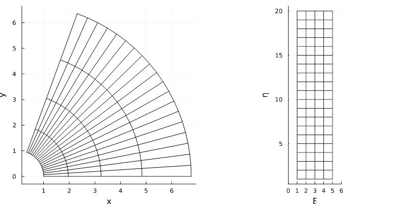

# CurvilinearGrids

[](https://github.com/smillerc/CurvilinearGrids.jl/actions/workflows/CI.yml?query=branch%3Amaster) [](https://opensource.org/licenses/MIT)

[](https://doi.org/10.5281/zenodo.14510380)

[](https://doi.org/10.21105/joss.07508)

`CurvilinearGrids.jl` is a Julia package for curvilinear structured grids, metric evaluation, and geometry-aware finite-difference workflows.

The package now exposes a unified API centered on:
- `MappedGrid`: grid defined from continuous mapping functions.
- `DiscreteGrid`: grid defined from coordinate arrays (with linear interpolation in computational space).
- `OrthogonalGrid`: wrapper around orthogonal legacy grids with unified geometry access.

For solver code, the package also exposes a small geometry/basis layer that is
intended to be the public source of truth for metric and basis metadata:
- `centroid` / `centroids`
- `face_coordinate`
- `basis_transfer_matrix`
- `cell_jacobian`
- `face_metric_coefficient`
- `face_flux_geometry` for mapped/discrete grids



## Installation

```julia
using Pkg
Pkg.add("CurvilinearGrids")
using CurvilinearGrids
```

## Quick Start (MappedGrid)

```julia
using CurvilinearGrids

x(t, ξ, η, p) = ξ + 0.15 * sin(0.3 * ξ) * cos(0.2 * η)
y(t, ξ, η, p) = η + 0.10 * cos(0.2 * ξ) * sin(0.3 * η)

grid = MappedGrid(x, y, (;), (64, 64), 5; cache_mode=:lazy)

I = first(grid.iterators.cell.domain)

pt = coord(grid, I)
ctr = centroid(grid, I)
cm = cell_metrics(grid)             # computed on first call in :lazy mode
fm = face_metrics(grid)
J = jacobian_matrix(grid, I)
V = cellvolume(grid, I)
```

## Unified Grid API

### Constructors

```julia
MappedGrid(x1[, x2[, x3]], params::NamedTuple, celldims, nhalo; kwargs...)
DiscreteGrid(x[, y[, z]], nhalo; kwargs...)
OrthogonalGrid(...; coordinate_system=..., kwargs...)
```

Useful keyword arguments for `MappedGrid` and `DiscreteGrid`:
- `cache_mode`: `:eager`, `:lazy`, or `:off`.
- `compute_metrics`: `true`/`false`.
- `coordinate_system`: `CurvilinearCS()`, `CartesianCS()`, `CylindricalCS()`, `SphericalCS()`, `AxisymmetricCS{:x|:y}()`.
- `basis`: `CartesianBasis()` or `SphericalBasis()`.
- `conserved_metric_scheme`: `EdgeInterpolationOrder1()`, `EdgeInterpolationOrder2()`, `EdgeInterpolationOrder3()`.

### Core geometry and metric calls

- `coord(grid, idx)` / `coords(grid)`
- `centroid(grid, idx)` / `centroids(grid)`
- `face_coordinate(grid, idx, loc)`
- `cellvolume(grid, idx)` / `cellvolumes(grid)`
- `cell_jacobian(grid, idx)`
- `face_metric_coefficient(grid, dim, idx)`
- `jacobian_matrix(grid, idx)`
- `forward_cell_metrics(grid, idx)` / `inverse_cell_metrics(grid, idx)`
- `basis_transfer_matrix(grid, from_q, to_q)`
- `basis_transfer_matrix(from_grid, from_q, to_grid, to_q)`
- `cell_metrics(grid; refresh=false)` / `face_metrics(grid; refresh=false)`
- `face_flux_geometry(grid, idx, loc)` for mapped/discrete grids
- `update!(grid, t, params)` for mapped/discrete time/parameter updates

For `MappedGrid` and `DiscreteGrid`, `idx` can be:
- discrete index tuples or `CartesianIndex` for all geometry/metric calls, and
- real-valued computational coordinates for `coord`, `jacobian_matrix`, `forward_cell_metrics`, `inverse_cell_metrics`, and `cellvolume` (for example `coord(grid, (5.25, 7.5))`).

## Solver-Facing Geometry and Basis API

The unified solver-facing split is:

- `OrthogonalGrid`:
  - use `cellvolume`, `face_area`, `cell_jacobian`, `face_metric_coefficient`,
    `centroid`, `face_coordinate`, and `basis_transfer_matrix`
  - there is no conserved face-metric cache and `face_flux_geometry` is not defined
- `MappedGrid` / `DiscreteGrid`:
  - use `cellvolume`, `centroid`, `face_coordinate`, `basis_transfer_matrix`,
    and `face_flux_geometry`
  - `face_metrics(grid)` remains the canonical low-level metric payload

`basis_transfer_matrix` returns the local basis change
`R_(to<-from)` for vector components stored in native physical coordinates.
Supported public cases currently include:

- identity transfer for Cartesian-basis mapped/discrete grids
- spherical transfer for 2-D and 3-D spherical-basis mapped/discrete grids
- identity transfer for orthogonal Cartesian, 1-D cylindrical, 1-D spherical,
  and 2-D axisymmetric meridional grids
- spherical transfer for orthogonal 2-D and 3-D spherical grids

Unsupported coordinate-system and basis combinations throw `ArgumentError`.

For mapped/discrete grids, `face_flux_geometry(grid, idx, loc)` exposes the
solver-facing face metric bundle:

```julia
geom = face_flux_geometry(grid, (i, j), :ihi)

geom.coordinate      # native physical face-center coordinate
geom.metric_vector   # active conserved face metric vector S^alpha
geom.area            # norm(metric_vector)
geom.normal          # metric_vector / area in the grid's physical basis
```

The mapped-grid contract is:
- `geom.metric_vector` is the outward-oriented active row of
  `face_metrics(grid)[axis].conserved[idx].jacobian_matrix`
- `geom.normal` is a solver-facing physical-basis normal
- `outward_face_normal(grid, idx, loc)` remains the embedded Cartesian surface
  normal API, which is distinct from `geom.normal`

On orthogonal grids, the corresponding face coordinate can still be queried
directly:

```julia
q_cell = centroid(grid, (i, j))
q_face = face_coordinate(grid, (i, j), :ihi)
R = basis_transfer_matrix(grid, q_cell, q_face)
```

## Metric Cache Controls

`MappedGrid` and `DiscreteGrid` store cell and face metric caches independently.

```julia
invalidate_cell_metrics!(grid)
invalidate_face_metrics!(grid)

refresh_cell_metrics!(grid)
refresh_face_metrics!(grid)
```

Disable metric storage entirely:

```julia
grid = MappedGrid(x, y, (;), (32, 32), 5; compute_metrics=false, cache_mode=:off)

# Cached metrics are unavailable:
# cell_metrics(grid)  # throws ArgumentError

# Continuous/discrete forward and inverse metrics still work:
F = forward_cell_metrics(grid, (8.2, 9.7))
G = inverse_cell_metrics(grid, (8.2, 9.7))
```

## Inverse Mapping (`x -> ξ`)

`computational_coordinate` solves the inverse map for mapped/discrete unified grids.

```julia
ξ_true = (12.5, 7.25)
x_phys = Tuple(coord(grid, ξ_true))

ξ = computational_coordinate(grid, x_phys)

result = computational_coordinate(
  grid,
  x_phys;
  guess=(1.0, 1.0),
  return_result=true,
  throw_on_failure=false,
)
```

`return_result=true` returns `InverseCoordinateResult` with:
- `coordinate`
- `converged`
- `iterations`
- `residual_norm`

## Multi-Block Interfaces

`MultiBlockMesh` connects multiple `MappedGrid`/`DiscreteGrid` blocks with strict 1-to-1 interfaces.

```julia
using CurvilinearGrids

b1 = DiscreteGrid(x1, y1, 2)
b2 = DiscreteGrid(x2, y2, 2)

interfaces = ((b1, :ihi) => (b2, :ilo),)
mb = MultiBlockMesh((b1, b2), interfaces; tolerance=1e-12)

exchange_interface!(mb, 1, [field_b1, field_b2]; field_kind=:scalar)
exchange_all_interfaces!(mb, [field_b1, field_b2]; field_kind=:vector)

ξ_right = computational_coordinate(mb, 1, (6.5, 4.25); from=:left)
```

Supported `field_kind` values:
- `:scalar`
- `:vector`
- `:tensor`

Multiblock vector/tensor exchange now uses the same public
`basis_transfer_matrix` API, so solver code and interface exchange rely on a
single basis-change contract.

## I/O

HDF5 read/write supports both legacy and unified grids:
- `write_coordinates(grid, filename, units)`
- `read_coordinates(filename, nhalo; compute_metrics=true, cache_mode=:eager)`

VTK output:
- `save_vtk(filename, grid)`

## Legacy API

Legacy grid types and constructors are still exported, including:
- `CurvilinearGrid1D`, `CurvilinearGrid2D`, `CurvilinearGrid3D`
- `rectilinear_grid`, `rtheta_grid`, `rthetaphi_grid`
- orthogonal legacy types (`CartesianOrthogonalGrid1D`, `CylindricalOrthogonalGrid1D`, `SphericalOrthogonalGrid1D`, `AxisymmetricOrthogonalGrid2D`)

New development should prefer the unified grid API (`MappedGrid`, `DiscreteGrid`, `OrthogonalGrid`) and multiblock API (`MultiBlockMesh`, `BlockInterface`, exchange/cache helpers).


## Jacobian matrices of transformation

Terminology can be somewhat confusing, but the "Jacobian matrix" is the matrix of partial derivatives that describe the forward or inverse transformation, and uses a bold-face $\textbf{J}$. The "Jacobian" then refers to the determinant of the Jacobian matrix, and is the non-bolded $J$. Some authors refer to the matrix as the "Jacobi matrix" as well. See [Wikipedia](https://en.wikipedia.org/wiki/Jacobian_matrix_and_determinant) for more details.

Forward transformation, or $T: (\xi,\eta,\zeta) \rightarrow (x,y,z)$. These functions are what is provided to the `CurvilinearGrid` constructors. See the included examples above and in the unit tests.

$$
\textbf{J} = 
\begin{bmatrix}
x_\xi & x_\eta & x_\zeta \\
y_\xi & y_\eta & y_\zeta \\
z_\xi & z_\eta & z_\zeta
\end{bmatrix}
$$

$$
J = \det [\textbf{J}]
$$

Inverse transformation $T^{-1}$: $(x,y,z) \rightarrow (\xi,\eta,\zeta)$ : 

$$
\textbf{J}^{-1} = 
\begin{bmatrix}
\xi_x   & \xi_y   & \xi_z   \\
\eta_x  & \eta_y  & \eta_z  \\
\zeta_x & \zeta_y & \zeta_z
\end{bmatrix}
$$

$$
J^{-1} = \det [\textbf{J}^{-1}]
$$

These matrices can be accessed by calling `J = jacobian_matrix(mesh, I::CartesianIndex)`. The inverse can be found via `inv(J)`. Note that the inverse metrics found this way _will not_ be conservative and may introduce errors into your discretization. This is why the inverse metrics are stored in `mesh.metrics`.


## Using metrics in a PDE discretization

Curvilinear transformations are often used to simulate PDEs like the heat equation or the Euler equations for fluid flow. A *vastly* simplified example is shown below, where the divergence of the flux ($\nabla \cdot q$) is found for a 1D rectilinear grid. A good description of metrics and PDE discretization is in Chapter 3 of [*Huang, W. & Russell, R. D. Adaptive Moving Mesh Methods*](https://link.springer.com/book/10.1007/978-1-4419-7916-2).


```julia
using CurvilinearGrids: rectilinear_grid
using CartesianDomains: shift

x0, x1 = (-1.0, 1.0)
ncells = 100
scheme = :meg6_symmetric

# rectilinear_grid() is a CurvilinearGrid1D constructor for uniform geometry
mesh = rectilinear_grid(x0, x1, scheme)
ξx = mesh.cell_center_metrics.ξ.x₁

const iaxis = 1

u = rand(size(mesh.iterators.cell.full)...) # solution
qᵢ₊½ = zeros(size(mesh.iterators.cell.full)) # flux of u
∇_dot_q = zeros(size(mesh.iterators.cell.full)) # flux divergence
α = ones(size(mesh.iterators.cell.full)) # diffusivity

# Find the fluxes across the edges
for i in mesh.iterators.cell.domain # only loop through the inner domain (ignore halo region)
  ᵢ₊₁ = shift(i, iaxis, +1) # shift is useful for indexing in arbitrary dimensions

  αᵢ₊½ = (α[i] + α[ᵢ₊₁]) / 2 # face averaged conductivity
  qᵢ₊½[i] = -αᵢ₊½ * (u[ᵢ₊₁] - u[i]) # flux of u across the interface at ᵢ₊½
end

# Now find the flux divergence
for i in mesh.iterators.cell.domain
  ᵢ₋₁ = shift(i, iaxis, -1)

  # note the use of the mesh metric, 
  # which for this case is just the cell spacing
  ∇_dot_q[i] = ξx[i]^2 * (qᵢ₊½[i] - qᵢ₊½[ᵢ₋₁])
end
```
