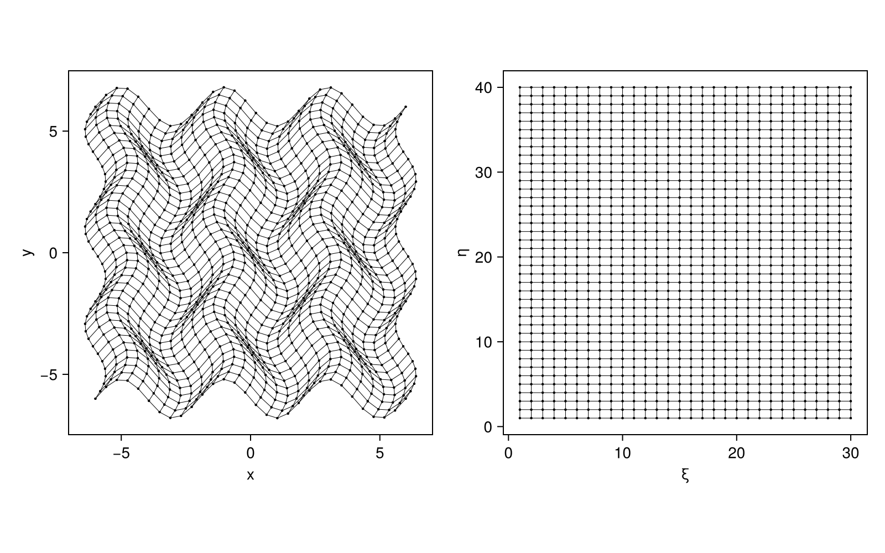

# Summary

Finite-difference discretizations of partial differential equations are widespread throughout the scientific community. Oftentimes finite-differences are used to compute spatial gradients of fields on a discrete grid, which is typically a uniform or rectilinear Cartesian mesh. *Arbitrary* multidimensional geometry is difficult to discretize directly with finite differences, however, due to non-uniform grid spacing and non-orthogonality. Curvilinear coordinate transformations can be used as a strategy to enable arbitrary geometry -- see for example, applications to the Euler and Navier-Stokes equations [@visbal2002; @chandravamsi2023]. While these curvilinear transformations are straightforward, the governing PDEs require additional terms (metrics) and must adhere to strict conservation laws; these criteria complicate the application of the transformation and require careful implementation. 

# Statement of Need

`CurvilinearGrids.jl` is a Julia [@julia] package designed to facilitate curvilinear coordinate transformations and the generation of metrics for arbitrary 1D, 2D, and 3D geometry. The API is designed for simple grid construction with minimal user effort; the backend handles the complicated book-keeping associated with metric computation and ensures strict adherence to geometric conservation laws when required. While Julia packages exist to facilitate standard finite-differences, there are few, if any, that provide conservative metrics for curvilinear transformations.

Grid metric computation is typically directly embedded into a particular simulation framework, rather than provided as a standalone library, since the metric and PDE discretizations must be consistent. Third-party grid generation software exists to provide complex multi-block structured grids for multi-physics codes but metrics are not provided -- metric computation must be tailored to the discretization of the simulation library. `CurvilinearGrids.jl` is unique in that it can be imported into existing Julia simulation libraries and immediately provide the ability to use curvilinear geometry (as long as the governing equations are appropriately modified). New discretization schemes (6th-order central finite-difference, 5th-order upwind, etc.) can be added in a straightforward manner to expand the capabilities of `CurvilinearGrids.jl`.

# Example Use

Users provide `CurvilinearGrids.jl` with discrete coordinate points defined in real-space $(x,y,z)$. These coordinates are then used to compute the transformation to a uniform computational coordinate space $(\xi,\eta,\zeta)$. A common example of this is to use a body-fit or conformal grid and transform it so that it becomes a uniform grid in $(\xi,\eta,\zeta)$. Standard finite-difference stencils can be used on the uniform transformed grid. \autoref{fig:grid} shows an example of a curvilinear grid defined in real-space and its representation in computational space. 



The grid in \autoref{fig:grid} is generated by the following code snippet.
```julia
using CurvilinearGrids

function wavygrid(ni, nj, nhalo=1)
  Lx = Ly = 12
  n_xy = n_yx = 6
  xmin, ymin = (-Lx / 2, -Ly / 2)
  Δx0,  Δy0 = (Lx / (ni - 1), Ly / (nj - 1))
  Ax, Ay = (0.4 / Δx0, 0.8 / Δy0)

  # coordinate arrays
  x = zeros(ni, nj)
  y = zeros(ni, nj)

  @inbounds for idx in CartesianIndices(x)
    i,j = idx.I
    x[i, j] = xmin + Δx0 * (
        (i - 1) + Ax * sinpi((n_xy * (j - 1) * Δy0) / Ly)
    )
      
    y[i, j] = ymin + Δy0 * (
        (j - 1) + Ay * sinpi((n_yx * (i - 1) * Δx0) / Lx)
    )
  end

  scheme = :meg6
  return CurvilinearGrid2D(x, y, scheme)
end

# number of nodes/vertices in each dimension
nx, ny = (30, 40)

nhalo = 2 # halo cells needed for stencils (can be set to 0)
grid = wavygrid(nx, ny, nhalo)
```

# Coordinate Transformations

Coordinate transformations require Jacobian matrices; terminology in the literature can be conflicting, but the "Jacobian matrix" is the matrix of partial derivatives that describe the forward or inverse transformation, and uses a bold-face $\textbf{J}$. The "Jacobian" then refers to the determinant of the Jacobian matrix, and is the non-bolded $J$. Some authors refer to the matrix as the "Jacobi matrix" as well. The forward transformation, or $T: (\xi,\eta,\zeta) \rightarrow (x,y,z)$ is defined as
$$
\textbf{J} = 
\begin{bmatrix}
x_\xi & x_\eta & x_\zeta \\
y_\xi & y_\eta & y_\zeta \\
z_\xi & z_\eta & z_\zeta
\end{bmatrix}, \quad J = \det [\textbf{J}]
$$
The inverse transformation $T^{-1}$: $(x,y,z) \rightarrow (\xi,\eta,\zeta)$ is defined as
$$
\textbf{J}^{-1} = 
\begin{bmatrix}
\xi_x   & \xi_y   & \xi_z   \\
\eta_x  & \eta_y  & \eta_z  \\
\zeta_x & \zeta_y & \zeta_z
\end{bmatrix}, \quad J^{-1} = \det [\textbf{J}^{-1}]
$$

# Grid Metrics

When solving transformed PDEs in computational coordinates ($\xi,\eta,\zeta$), grid metrics **must** be included. Care must be taken if advection or motion is included in the governing equations so that the geometric conservation law (GCL) is observed [@thomas1979]. If the scheme does not follow the GCL, errors will build up and ultimately corrupt the solution. In the case of fluid dynamics, the mesh and governing equation discretizations must follow the same scheme and be *conservative* [@visbal2002]. One such conservative scheme is the Monotone Explicit Gradient (MEG) based reconstruction [@chamarthi2023; @chandravamsi2023], which is included in `CurvilinearGrids.jl`. Other common schemes include weighted essentially non-oscillatory (WENO) schemes of various order [@ma2024]. There is no restriction to particular schemes which can be added in the future.

The grid metrics (derivative terms in $\textbf{J}, \textbf{J}^{-1}$) at each cell-center or edge are accessed through the `AbstractCurvilinearGrid` types exported by `CurvilinearGrids.jl`. The API currently supports 1D, 2D, and 3D geometry, with axisymmetric modes for 1D (spherical and cylindrical) and 2D (cylindrical RZ). Metrics (entries in the forward/inverse Jacobian matrices) are contained in `StructArrays` for each dimension; forward metrics $(x_\xi, y_\xi, ...)$, inverse metrics $(\xi_x, \xi_y, ...)$, and normalized inverse metrics $(\hat{\xi}_x \equiv J\xi_x)$. Some authors define the normalized metric as $\hat{\xi}_x \equiv \xi_x/J$, but the definition of the forward and inverse Jacobians are swapped. Chapter 3 in @huang2011 has a particularly lucid description of how these metrics can be included in PDE discretizations.

Each grid type includes the following metrics:

- Cell centered metrics: $(\eta_y, y_\xi, ...)$ via `grid.cell_center_metrics`
- Edge centered metrics (`grid.edge_metrics`): Inverse $\xi_x$, and normalized inverse $\hat{\xi}_x$ at $i+1/2, j+1/2, k+1/2$
- Temporal metrics: $\xi_t, \eta_t, \zeta_t$ for both cell-centered and edge metrics.

Both edge and cell-centered metrics are required for many PDE discretizations -- the interpolation from cell-center to edge must be consistent, i.e., the same interpolation scheme must be shared by the PDE discretization and mesh metric computation. One such scheme that is included in `CurvilinearGrids.jl` is the 6th-order MEG scheme. Finding the forward metric $(\phi_\xi = \phi_{i+1/2} - \phi_{i-1/2})$ is accomplished by the following:
               
$$
\begin{aligned}
\phi_{i+1/2} &= \frac{1}{2} \left ( \phi^L_{i+1/2} + \phi^R_{i+1/2} \right) \\
             &= \frac{1}{2} \left [ 
                \left (\phi_{i} + \frac{1}{2} \phi'_{i} + \frac{1}{12} \phi''_{i} \right ) +
                \left (\phi_{i+1} + \frac{1}{2} \phi'_{i+1} + \frac{1}{12} \phi''_{i+1} \right )
             \right ]
\\
\phi_{i-1/2} &= \frac{1}{2} \left ( \phi^L_{i-1/2} + \phi^R_{i-1/2} \right) \\
             &= \frac{1}{2} \left [ 
                \left (\phi_{i-1} + \frac{1}{2} \phi'_{i-1} + \frac{1}{12} \phi''_{i-1} \right ) +
                \left (\phi_{i} + \frac{1}{2} \phi'_{i} + \frac{1}{12} \phi''_{i} \right )
             \right ]
\end{aligned}
$$
Where the first derivative is defined as
$$
\begin{aligned}
 \left ( \frac{\partial \phi}{\partial \xi} \right )_i  = 
 \frac{3}{4}  (\phi_{i+1} + \phi_{i-1}) +
 \frac{3}{20} (\phi_{i+2} + \phi_{i-2}) +
 \frac{1}{60} (\phi_{i+3} + \phi_{i-3}),
\end{aligned}
$$
and the second derivative is
$$
\begin{aligned}
 \left ( \frac{\partial^2 \phi}{\partial \xi^2} \right )_i  = 
 2(\phi_{i+1} - 2\phi_i + \phi_{i-1}) +
 \frac{1}{2} \left [ \left ( \frac{\partial \phi}{\partial \xi} \right )_{i+1} - 
 \left ( \frac{\partial \phi}{\partial \xi} \right )_{i-1} \right ].
\end{aligned}
$$
At boundaries, one-sided or partially one-sided finite difference equations must be used. In future releases, additional discretization schemes will be included.

# Acknowledgments
This material is based upon work supported by the Department of Energy [National Nuclear Security Administration] University of Rochester “National Inertial Confinement Fusion Program” under Award Number(s) DE-NA0004144.

This report was prepared as an account of work sponsored by an agency of the United States Government. Neither the United States Government nor any agency thereof, nor any of their employees, makes any warranty, express or implied, or assumes any legal liability or responsibility for the accuracy, completeness, or usefulness of any information, apparatus, product, or process disclosed, or represents that its use would not infringe privately owned rights. Reference herein to any specific commercial product, process, or service by trade name, trademark, manufacturer, or otherwise does not necessarily constitute or imply its endorsement, recommendation, or favoring by the United States Government or any agency thereof. The views and opinions of authors expressed herein do not necessarily state or reflect those of the United States Government or any agency thereof.

# References
