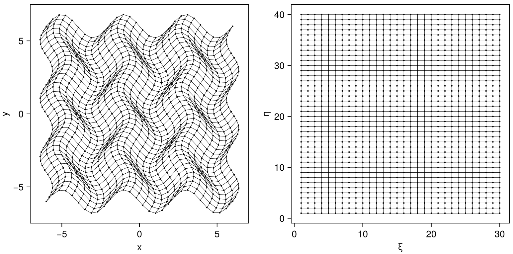

# Summary

Curvilinear coordinate transformations are the process by which grids are transformed from real-space $(x,y,z)$ to computational space $(\xi,\eta,\zeta)$

# Statement of need
`CurvilinearGrids.jl` is a Julia package for computing the metrics required for curvilinear transformations commonly used for finite-difference discretizations of partial differential equations (PDEs). The API is designed to handle the complicated book-keeping associated with metric computation on multidimensional meshes and make it simple to encorporate arbitrary geometry into various PDE-oriented codes.

The core function of `CurvilinearGrids.jl` is to take coorinate points defined by the user in real-space $(x,y,z)$ and compute the Jacobian matrices required to transform to a uniform computational coordinate space $(\xi,\eta,\zeta)$.


A common example of this is to use a body-fit mesh, e.g. a mesh around a wing, and transform it so that it becomes a uniform grid in $(\xi,\eta,\zeta)$. Then standard finite-difference stencils can be used on the uniform transformed grid. Below is an example of a cylindrical mesh in $(x,y)$ coordinates and the corresponding logical grid in $(\xi,\eta)$.



`CurvilinearGrids.jl` currently defines the `CurvilinearGrid2D` and `CurvilinearGrid3D` types. To construct these, you need to provide the functional form of the grid, e.g. `x(i,j), y(i,j)` for a 2D mesh. 

### Example
```julia
using CurvilinearGrids

function wavygrid(ni, nj, nhalo=1)
  Lx = Ly = 12
  n_xy = n_yx = 6
  xmin = -Lx / 2
  ymin = -Ly / 2

  Δx0 = Lx / (ni - 1)
  Δy0 = Ly / (nj - 1)

  Ax = 0.4 / Δx0
  Ay = 0.8 / Δy0

  # coordinate arrays
  x = zeros(ni, nj)
  y = zeros(ni, nj)

  @inbounds for idx in CartesianIndices(x)
    i,j = idx.I
    x[i, j] = xmin + Δx0 * (
        (i - 1) + Ax * sinpi((n_xy * (j - 1) * Δy0) / Ly)
    )
      
    y[i, j] = ymin + Δy0 * (
        (j - 1) + Ay * sinpi((n_yx * (i - 1) * Δx0) / Lx)
    )
  end

  return CurvilinearGrid2D(x, y, nhalo)
end

# number of nodes/vertices in each dimension
nx, ny = (30, 40)

nhalo = 2 # halo cells needed for stencils (can be set to 0)
grid = wavygrid(nx, ny, nhalo)
```

# Exported Functionality

Accessing mesh metrics

- cell centered metrics: $\eta_y$ is `cell_center_metrics.ξ.x₂[idx]`
- Cell Jacobian (length in 1D, area in 2D, volume in 3D): `cell_center_metrics.J[idx]`
- Spatial metric $\partial y / \partial \xi$, or $y_\xi$ is `cell_center_metrics.x₂.ξ[idx]`
- Temporal metric $\partial \zeta / \partial t$, or $\zeta_t$ is `cell_center_metrics.ζ.t[idx]`


<!-- 
The API currently supports 1D, 2D, and 3D geometry, with axisymmetric modes for 1D (spherical and cylindrical) and 2D (cylindrical RZ). The axisymmetric grid types include additional APIs to handle the rotational symmetry inherint int he axisymmetric modes. derp...

Here `idx` can be a `Tuple` or `CartesianIndex`, and mesh is an `AbstractCurvilinearGrid`. **Important:** The indices provided to these functions are aware of halo regions, so the functions do the offsets for you. This is by design, since fields attached to the mesh, like density or pressure for example, _will_ have halo regions, and loops through these fields typically have pre-defined limits that constrain the loop to only work in the non-halo cells. If you don't use halo cells, just set `nhalo=0` in the constructors.

The index can be a `Tuple`, scalar `Integer`, or `CartesianIndex`.
- `coord(mesh, idx)`: Get the $(x,y,z)$ coordinates at index `idx`. This can be 1, 2, or 3D.
- `centroid(mesh, idx)`:  Get the $(x,y,z)$ coordinates of the cell centroid at cell index `idx`. This can be 1, 2, or 3D.
- `metrics(mesh, idx)`: Get the cell metric information, e.g. $\xi_x, \xi_y$, etc.
- `conservative_metrics(mesh, idx)`: Get the metrics that are consistent with the Geometric Conservation Law (GCL)
- `jacobian(mesh, idx)`: Get the determinant of the Jacobian matrix of forward transformation, $J$
- `jacobian_matrix(mesh, idx)`: Get the Jacobian matrix of the forward transformation

These functions are primarily used to get the complete set of coordinates for plotting or post-processing. These do _not_ use halo regions, since there geometry is ill-defined here.
- `coords(mesh)` Get the: array of coordinates for the entire mesh (typically for writing to a .vtk for example)
- `centroids(mesh)` Get the: array of centroid coordinates for the entire mesh (typically for writing to a `.vtk` file) -->


# Jacobian matrices of transformation

Terminology can be somewhat confusing, but the "Jacobian matrix" is the matrix of partial derivatives that describe the forward or inverse transformation, and uses a bold-face $\textbf{J}$. The "Jacobian" then refers to the determinant of the Jacobian matrix, and is the non-bolded $J$. Some authors refer to the matrix as the "Jacobi matrix" as well. See [Wikipedia](https://en.wikipedia.org/wiki/Jacobian_matrix_and_determinant) for more details.

Forward transformation, or $T: (\xi,\eta,\zeta) \rightarrow (x,y,z)$. These functions are what is provided to the `CurvilinearGrid` constructors. See the included examples above and in the unit tests.

$$
\textbf{J} = 
\begin{bmatrix}
x_\xi & x_\eta & x_\zeta \\
y_\xi & y_\eta & y_\zeta \\
z_\xi & z_\eta & z_\zeta
\end{bmatrix}
$$

$$
J = \det [\textbf{J}]
$$

Inverse transformation $T^{-1}$: $(x,y,z) \rightarrow (\xi,\eta,\zeta)$ : 

$$
\textbf{J}^{-1} = 
\begin{bmatrix}
\xi_x   & \xi_y   & \xi_z   \\
\eta_x  & \eta_y  & \eta_z  \\
\zeta_x & \zeta_y & \zeta_z
\end{bmatrix}
$$

$$
J^{-1} = \det [\textbf{J}^{-1}]
$$

# Grid Metrics

When solving equations such as the Navier-Stokes in transformed form (in $\xi,\eta,\zeta$), you need to include the grid metric terms. Providing these for the grid is the primary objective of `CurvilinearGrids.jl`. These conservative grid metrics satisfy the Geometric Conservation Law `[@thomas1979, @visbal2002]`.

Monotone Explicit Gradient based reconstruction `[@chamarthi2023; @chandravamsi2023]`


$$
\hat{\xi}_x, \hat{\xi}_y,...
$$

The subscript denotes a partial derivative, so $\xi_x = \partial \xi / \partial x$. 


# Conservative Grid Metrics
Interpolating from cell center to edge
$$
\begin{aligned}
\phi_{i+1/2} &= \frac{1}{2} \left ( \phi^L_{i+1/2} + \phi^R_{i+1/2} \right) \\
             &= \frac{1}{2} \left [ 
                \left (\phi_{i} + \frac{1}{2} \phi'_{i} + \frac{1}{12} \phi''_{i} \right ) +
                \left (\phi_{i+1} + \frac{1}{2} \phi'_{i+1} + \frac{1}{12} \phi''_{i+1} \right )
             \right ]
\\
\phi_{i-1/2} &= \frac{1}{2} \left ( \phi^L_{i-1/2} + \phi^R_{i-1/2} \right) \\
             &= \frac{1}{2} \left [ 
                \left (\phi_{i-1} + \frac{1}{2} \phi'_{i-1} + \frac{1}{12} \phi''_{i-1} \right ) +
                \left (\phi_{i} + \frac{1}{2} \phi'_{i} + \frac{1}{12} \phi''_{i} \right )
             \right ]
\end{aligned}
$$

MEG6 1st deriv
$$
\begin{aligned}
 \left ( \frac{\partial \phi}{\partial \xi} \right )_i  = 
 \frac{3}{4}  (\phi_{i+1} + \phi_{i-1}) +
 \frac{3}{20} (\phi_{i+2} + \phi_{i-2}) +
 \frac{1}{60} (\phi_{i+3} + \phi_{i-3})
\end{aligned}
$$

MEG6 2nd deriv
$$
\begin{aligned}
 \left ( \frac{\partial^2 \phi}{\partial \xi^2} \right )_i  = 
 2(\phi_{i+1} - 2\phi_i + \phi_{i-1}) +
 \frac{1}{2} \left [ \left ( \frac{\partial \phi}{\partial \xi} \right )_{i+1} - 
 \left ( \frac{\partial \phi}{\partial \xi} \right )_{i-1} \right ]
\end{aligned}
$$


# References